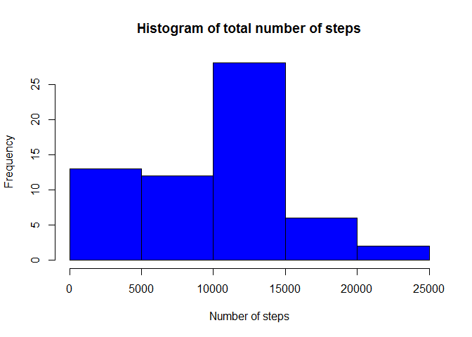
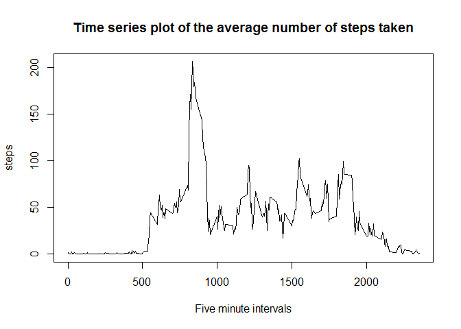
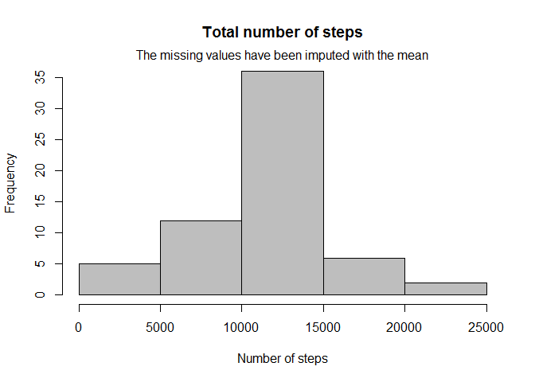
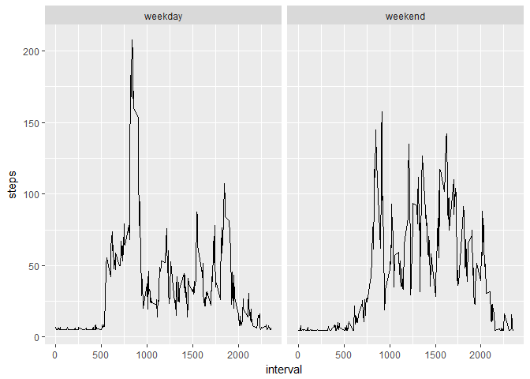

## Loading and preprocessing the data
Loading additional libraries:

```r
library(dplyr)
```

```
## 
## Attaching package: 'dplyr'
```

```
## The following objects are masked from 'package:stats':
## 
##     filter, lag
```

```
## The following objects are masked from 'package:base':
## 
##     intersect, setdiff, setequal, union
```

```r
library(ggplot2)
```


```r
setwd("C:\\Users\\hp pc\\RepData_PeerAssessment1")
data<-read.csv("activity/activity.csv")
```

## The following plot shows the total number of steps taken each day.

```r
group_data<-group_by(data,date)
summ_data<-summarize(group_data,steps=sum(steps,na.rm=TRUE))
hist(summ_data$steps,col="blue",xlab="Number of steps",main="Histogram of total number of steps")
```

<!-- -->

## Mean and median number of steps taken each day

```r
mn=mean(summ_data$steps,na.rm=T)
md=median(summ_data$steps,na.rm=T)
```
The mean number of steps taken each day is 9354.2295082 and the median number of steps each day is 10395

## Time series plot of the average number of steps taken

```r
group_data<-group_by(data,interval)
summ_data<-summarize(group_data,steps=mean(steps,na.rm=TRUE))
with(summ_data,plot(interval,steps,type="l",xlab="Five minute intervals",main="Time series plot of the average number of steps taken"))
```

<!-- -->

## The 5-minute interval that, on average, contains the maximum number of steps

```r
m<-max(summ_data$steps)
minterval<-as.numeric(select(filter(summ_data,steps==m),interval))
```

The 5-minute interval that,on average,contains the maximum numbe of steps is 835.

## Code to describe and show a strategy for imputing missing data

```r
nmiss<-sum(is.na(data$steps))
```

The number of rows containing NA values are 2304 

### imputing missing values

```r
id<-is.na(data$steps)
data[id,1]<-mean(data$steps,na.rm=TRUE)
```
The missing values have been imputed with the mean of the steps.

## Histogram of the total number of steps taken each day after missing values are imputed

```r
group_data<-group_by(data,date)
summ_data<-summarize(group_data,steps=sum(steps,na.rm = TRUE))
hist(summ_data$steps,xlab="Number of steps",main="Total number of steps",col="gray")
mtext("The missing values have been imputed with the mean",outer=FALSE)
```

<!-- -->

## Panel plot comparing the average number of steps taken per 5-minute interval across weekdays and weekends

```r
data<-transform(data,date=as.Date(date))
weekend<-c("Saturday","Sunday")
data$day_type<-ifelse(weekdays(data$date) %in% weekend,"weekend","weekday")
group_data<-group_by(data,day_type,interval)
summ_data<-summarize(group_data,steps=mean(steps,na.rm=TRUE))
ggplot(summ_data,aes(interval,steps))+geom_line()+facet_grid(.~day_type)
```

<!-- -->

